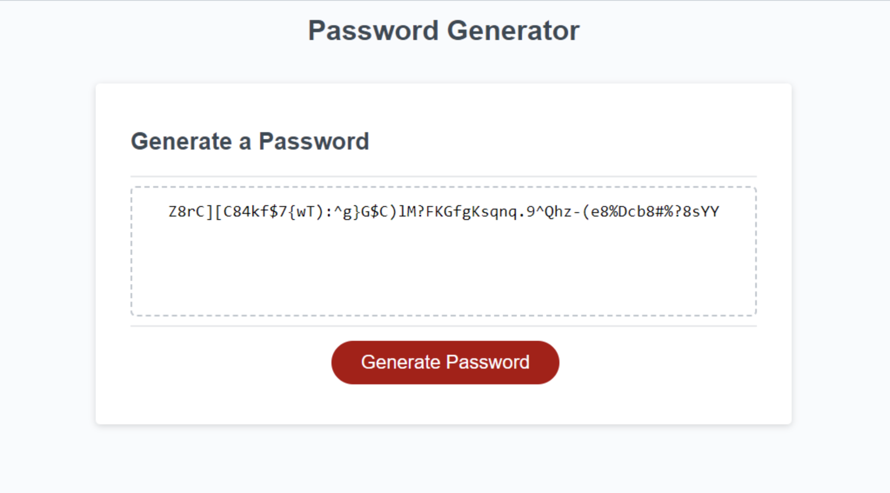

# Password-Generator
Welcome to my Password Generator project – a tool I made for creating strong and secure passwords. No need to stress about coming up with complex combinations; let my web-based application figure it out for you.You can access the live website [here.](https://ikramismailx.github.io/Password-Generator/)


# Table of Contents
- [Features](#features)
- [Getting Started](#getting-started)
- [Usage](#usage)
- [Contributing](#contributing)
- [License](#license)

# Features
- Easy Customisation: Pick the length and the type of characters you want in your password (uppercase, lowercase, numbers, or special characters) to meet different platform requirements.

- Quick Passwords: Get a strong password in less than a few minutes.

- Simple Interface: Whether you're a professional or a beginner, my user-friendly interface makes creating strong passwords a piece of cake.

# Getting Started
To get a copy of this project up and running on your local machine, follow these steps:

Clone this repository to your local machine using git clone:
```
git clone https://github.com/ikramismailx/Password-Generator.git
```

Navigate to the project directory:

```
cd Password-Generator
```

Open the index.html file in your web browser to view the webpage and press the button!

# Usage
The webpage should present the following:



# Contributing

I welcome contributions and feedback! If you have suggestions for improvements, bug reports, or would like to collaborate on a project, please open an issue or submit a pull request.

# License

This project is licensed under the [MIT](https://github.com/ikramismailx/Password-Generator/blob/main/LICENSE) License. You are free to use, modify, and distribute it, as long as you include the appropriate attribution and adhere to the terms of the license.